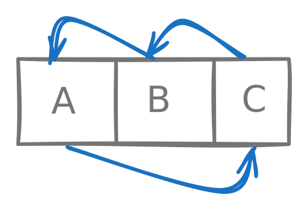

# Permute the elements of an array

## Description

Given an array $A$ of $n$ elements and a permutation $P$, apply $P$ to $A$.

## Example

```
   A = [1, 2, 3, 4]
perm = [3, 2, 1, 0]

  A' = [4, 3, 2, 1]
```

## Stub

```kotlin
fun applyPermutation(perm: MutableList<Int>, A: MutableList<Int>) {
  // TODO - you fill in here.
}
```

## Solution

??? "Approach 1"

    Simply use an auxilliary array $A$.

    ```kotlin
    fun applyPermutation(perm: MutableList<Int>, A: MutableList<Int>) {
      val out = A.toMutableList()

      for ((i, v) in A.withIndex()) {
        out[perm[i]] = v
      }

      A.clear()
      A.addAll(out)
    }
    ```

    This needs $O(n)$ space.

??? "Approach 2"

    Use **Cycle Decomposition**.

    ```kotlin linenums="1" hl_lines="5"
    fun applyPermutation(perm: MutableList<Int>, A: MutableList<Int>) {
      for (i in A.indices) {
        var next = i;
        while (perm[next] >= 0) {
          A.swap(i, perm[next])   // magic line
          val temp = perm[next]
          perm[next] -= perm.size
          next = temp
        }
      }
    }
    ```

    Let's assume `Array = [A, B, C]` and `perm = [2, 0, 1]`. That is $0 \rightarrow 2 \rightarrow 1 \rightarrow 0$.

    {width=200px}

    We use `A[i]` as the holding cell in each iteration of the top loop.

    1. Iteration 1

        - Current holding cell `Array[0]` contains `A`
        - `perm[0] = 2`
        - `swap(0, 2)`
        - `C` is now held in the holding cell `Array[0]`
        - Array is now `[C, B, A]`

    2. Iteration 2

        - Current holding cell `Array[0]` contains `C`
        - `perm[2] = 1`
        - `swap(0, 1)`
        - `B` is now held in the holding cell `Array[0]`
        - Array is now `[B, C, A]`

    2. Iteration 3

        - Current holding cell `Array[0]` contains `B`
        - `perm[1] = 0`
        - `swap(0, 0)`
        - `B` is already held in the holding cell `Array[0]`
        - Array is unchanged `[B, C, A]`

    `Array[i]` acts as a buffer. Every swap **placed one element correctly** while leaving one new element stranded which needs to be fixed in the next iteration of the inner loop.