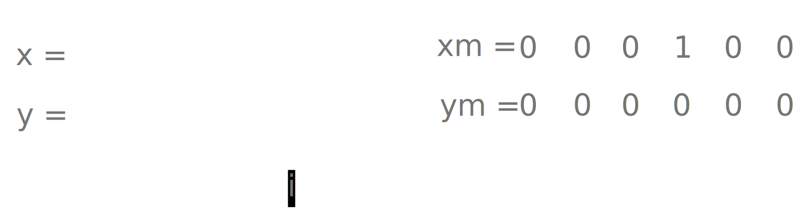

# Compute $x + y$ without arithmetical operators

## Description

Add two integers using only bitwise operators.

## Stub

```java
public static int add(int x, int y) {
  // Fill me.
}
```

## Hint

| $a$ | $b$ | $c$ | $sum$ | $carry$ |
| --- | --- | --- | ----- | ------- |
| $0$ | $0$ | $0$ | $0$   | $0$     |
| $1$ | $0$ | $0$ | $1$   | $0$     |
| $0$ | $1$ | $0$ | $1$   | $0$     |
| $0$ | $0$ | $1$ | $1$   | $0$     |
| $1$ | $1$ | $0$ | $0$   | $1$     |
| $1$ | $0$ | $1$ | $0$   | $1$     |
| $0$ | $1$ | $1$ | $0$   | $1$     |
| $1$ | $1$ | $1$ | $1$   | $1$     |

Which suggests that

$$
\begin{align}
sum &= a \oplus b \oplus c \\
carry &= (a \ {\small \&} \ b) \ | \ (b \ {\small \&} \ c) \ | \ (a \ {\small \&} \ c)
\end{align}
$$

## Solution

??? "First approach"

    {width=400}

    ```kotlin linenums="1"
    fun add(x: Int, y: Int): Int {
      var sum = 0
      var carry = 0
      var i = 0

      var tempX = x
      var tempY = y

      while(tempX != 0 || tempY != 0) { // (1)
        val xm = x and (1 shl i) // (2)
        val ym = y and (1 shl i) // (3)
        sum = sum or (xm xor ym xor carry)
        carry = ((xm and ym) or (xm and carry) or (ym and carry)) shl 1
        i++

        tempX = tempX ushr 1
        tempY = tempY ushr 1
      }

      return sum or carry
    }
    ```

    1. optimized from `while(i < 32)`, so the loop runs only until all bits are exhausted.
    2. Only used to check when all set bits of $x$ are exhausted.
    3. Only used to check when all set bits of $y$ are exhausted.

??? "Second approach"

    The key ideas behind this approach is to perform the sum as if there are no carries and then accounting for those carries separately.

    * $x \oplus y$ gives us the sum of all bits **as if** there were no carries. For example:

    ```
     00   00   00   00
    ⊕00  ⊕01  ⊕10  ⊕11
    ---  ---  ---  ---
     00   01   10   11

     01   01   01   01
    ⊕00  ⊕01  ⊕10  ⊕11
    ---  ---  ---  ---
     01   00   11   10
          ^        ^^

     10   10   10   10
    ⊕00  ⊕01  ⊕10  ⊕11
    ---  ---  ---  ---
     10   11   00   01
              ^    ^
    ```

    here `^` refers to unaccounted for carries.

    * $(x \ {\small \&} \ y) << 1$ finds all the "carry" bits (where both $x$ and $y$ had a $1$) and shifts them one position to the left, which is where they need to be added.

    ```kotlin
    fun add(a: Int, b: Int): Int {
      var x = a
      var y = b

      // Loop until there are no more carries (y becomes 0)
      while (y != 0) {
        val carry = (x and y) shl 1 // (1)
        x = x xor y // (2)
        y = carry // (3)
      }

      // When y is 0, 'x' holds the final sum.
      return x
    }
    ```

    1. $(x \ {\small \&} \ y) << 1$ calculate the carry.
    2. Calculate the sum without accounting for carry.
    3. Carry becomes the new $y$.

## Unit tests

```kotlin
@Test
fun first() {
  assertThat(add(1, 2)).isEqualTo(3)
}

@Test
fun second() {
  assertThat(add(19, 5)).isEqualTo(24)
}

@Test
fun third() {
  assertThat(add(-15, -19)).isEqualTo(-34)
}

@Test
fun fourth() {
  assertThat(add(Int.MAX_VALUE, 1)).isEqualTo(Int.MIN_VALUE)
}

@Test
fun fifth() {
  assertThat(add(Int.MIN_VALUE, -1)).isEqualTo(Int.MAX_VALUE)
}

@Test
fun rand() {
  val rand = ThreadLocalRandom.current()

  for (i in 1 until 1000) {
    val a = rand.nextInt()
    val b = rand.nextInt()
    println("adding $a and $b for ${a + b}")
    assertThat(add(a, b)).isEqualTo(a + b)
  }
}
```
